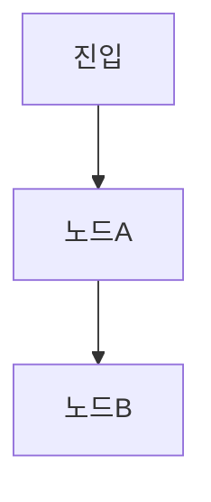

# 범용 DDD 기획→구현 프레임워크 구현 계획

> **For agentic workers:** REQUIRED SUB-SKILL: Use superpowers:subagent-driven-development (recommended) or superpowers:executing-plans to implement this plan task-by-task. Steps use checkbox (`- [ ]`) syntax for tracking.

**Goal:** 어떤 프로젝트든 `.claude/`에 드롭인해 기획 단계부터 DDD(씬/데이터 두 컨텍스트) 중심으로 구현까지 끌고 가는 범용 프레임워크를, 마크다운 스킬·에이전트 + 폴더 규약 + 템플릿 + 구현 스크립트 1개로 만든다.

**Architecture:** 코드 로직 없음(시뮬 HTML·PS 스크립트 제외). `plan-advise`(아이디어 분류)→`plan-document`(위키 구축, plan-scene/plan-data/plan-distill 위임)→`plan-qa`(HTML 시뮬레이션으로 빈틈 취합·융합)→`dev-arch`(패턴 정책)→`dev-ticket`(자기완결 티켓)→`implement.ps1`(branch 따고 codex/claude로 구현). DsTurn `gd-*`/`dev-*`를 게임 어휘 제거하고 일반화.

**Tech Stack:** 마크다운(스킬·에이전트·규약·템플릿) + 단일 HTML(시뮬 아티팩트) + PowerShell(구현 핸드오프 스크립트 1개).

**Spec:** [docs/superpowers/specs/2026-06-17-범용-ddd-프레임워크-design.md](../specs/2026-06-17-범용-ddd-프레임워크-design.md).

**검증:** 코드 단위 테스트 대신 **구조·일관성 리뷰**(Task 13). 각 산출 파일은 생성 직후 규약(`docs/conventions.md`)·스펙과 경로·용어가 일치하는지 점검한다.

**전체 산출 트리:**
```
docs/conventions.md
templates/{README.md,플로우.md,요소.md,데이터.md,기능.md,일지.md,ticket.md,sim.html,CLAUDE.snippet.md}
agents/{plan-advise.md,plan-document.md,plan-qa.md}
skills/{plan-scene,plan-data,plan-distill,plan-simulate,dev-arch,dev-ticket}/SKILL.md
scripts/implement.ps1
README.md
```

---

## Task 1: 규약 문서 (`docs/conventions.md`)

위키 레이아웃 + 두 컨텍스트 분할 + 라우팅 + 일지 하네스 + 위키 루트 설정을 한곳에 정의. 모든 스킬·에이전트가 참조한다.

**Files:** Create `docs/conventions.md` (기존 게임용 conventions는 working tree에서 이미 삭제됨)

- [ ] **Step 1: 작성**

````markdown
# DDD 프레임워크 규약

## 위키 루트 (대상 프로젝트에 생성)

기본값 `docs/ddd/`. 첫 실행(`plan-advise`/`plan-document`) 시 사람에게 1회 확인해 확정한다. 이하 `<wiki>`로 표기.

```
<wiki>/
  HOME.md                      # 목차 — 씬·데이터 도메인 목록 (신규 vs 기존 판별의 출처)
  CONTEXT.md                   # 용어집 — 도메인 용어 한 줄 정의 (중복·소속 확인 출처)
  scene_<name>/                # 씬 도메인 (프론트: UI+플로우)
    README.md · 플로우.md · 요소/<노드>.md · 일지.md · [화면기획/]
  data_<name>/                 # 데이터 도메인 (백엔드: 데이터+기능)
    README.md · 데이터.md · 기능_<name>.md · 일지.md
  _작업중/<feature>/            # 복잡 기능 staging (경계 미분할, 분산 후 삭제)
docs/arch/ARCHITECTURE.md      # 아키텍처 + 패턴 정책 (dev-arch)
tickets/NNNN-<slug>.md         # 구현 티켓 (branch frontmatter)
_sim/<feature>.html            # 시뮬레이션 아티팩트 (임시, 융합 후 삭제)
```

## 두 바운디드 컨텍스트 (DDD 분할)

| 컨텍스트 | 담당 | 성분 | 위치 |
|---|---|---|---|
| **씬(Scene)** | UI 요소 + 플로우 (프론트) | 오케스트레이션 + 표현(V) | `<wiki>/scene_<name>/` |
| **데이터(Data)** | 내부 데이터 + 기능 (백엔드) | 데이터(M) + 기능(C) | `<wiki>/data_<name>/` |

- 흐름·화면·전환 → 씬. 무엇이 무슨 값을 갖고 어떻게 계산되나 → 데이터.
- 대부분의 "기능"은 둘 다 → 성분별로 쪼개 각각 라우팅.
- 씬 요소 §호출기능 = 데이터 기능 **링크만**(구현 로직 금지). 데이터 기능 = "무슨 데이터를 읽고 어떻게 처리하나"만(언제 부르나는 씬이 정함).
- 단계 표기: **M**=데이터 · **C**=기능 · **V**=표현.

## 라우팅 (자유 입력 1건 처리)

1. **컨텍스트 판단** — 씬 / 데이터 / 둘 다. (`HOME.md`·`CONTEXT.md` 대조)
2. **신규 vs 기존 판단** — `HOME.md` 목록에 있나. 있으면 기존 도메인에 추가, 없으면 신규.
3. **위임** — 씬 → `plan-scene`, 데이터 → `plan-data`. 섞이면 성분별로 하나씩 순차.

## 신성불가침 (전 스킬·에이전트 공통)

1. **AI는 값을 생성하지 않는다** — 수치·규칙·계산식·enum 의미는 `*[입력 필요: …]*` 슬롯. AI가 짓는 건 ① 뼈대 문장 ② 슬롯 표시 ③ 질문뿐.
2. **경계** — 씬=플로우+표현 / 데이터=데이터+기능. 섞이면 분리.
3. **일지 하네스** — 도메인 파일 편집 전 그 `일지.md`를 읽고, 의미 있는 변경 후 항목 1개 추가 + `현재 상태 요약` 갱신. 오타·링크 정리는 제외.
4. **한 번에 한 갈림길** — 여러 도메인이 나와도 하나씩.
5. **뒤에 덧붙이기 금지** — 누락 분기는 기존 문장에 in-place 융합(문서 끝 새 섹션 금지). 결정이력은 본문 금지(일지로).
````

- [ ] **Step 2: 점검** — `<wiki>`·`scene_<name>`·`data_<name>`·`_작업중`·`_sim`·`tickets`·`docs/arch` 경로 표기가 스펙 §5와 일치하는지 눈으로 확인.

- [ ] **Step 3: 커밋**

```bash
git add docs/conventions.md
git commit -m "docs: DDD 프레임워크 규약"
```

---

## Task 2: 기획 템플릿 (`templates/` 일부)

`plan-scene`/`plan-data`가 골격 생성에 복사·치환할 정적 템플릿. 기울임 안내문은 채우는 사람이 덮어쓴다.

**Files:** Create `templates/README.md`, `templates/플로우.md`, `templates/요소.md`, `templates/데이터.md`, `templates/기능.md`, `templates/일지.md`, `templates/CLAUDE.snippet.md`

- [ ] **Step 1: `templates/README.md`**

```markdown
# <DOMAIN_NAME>

*이 도메인이 무엇을 책임지는지 한 줄.*

## 구성
*씬이면 요소 목록(요소/<노드>.md 링크), 데이터면 데이터.md + 기능 목록.*

## 책임지지 않는 것
*인접 도메인이 맡는 것 — 경계 명시.*
```

- [ ] **Step 2: `templates/플로우.md`** (씬 전용)

````markdown
# <SCENE_NAME> 플로우



## 씬 전체 값
- **입력 계약** *(진입 시 받는 값 — 목록만, 수치는 [입력 필요])*
- **노드 간 전이값** *(노드→노드로 넘기는 값)*
- **출력** *(나갈 때 넘기는 값)*

## 전역 연출 (V)
*상시 HUD·공통 표현 등. 없으면 (없음).*
````

- [ ] **Step 3: `templates/요소.md`** (씬 노드 1개 — 8섹션)

```markdown
# 요소: <NODE_NAME>

*이 노드 한 줄 설명.*

## 진입·트리거
*어떻게 이 노드에 들어오나.*

## 로드하는 값 (입력)
*진입 시 보장되는 값 + 이 노드가 읽는 값.*

## 호출하는 기능
*데이터 도메인 기능 링크만 — 구현 로직 금지. 예: [data_X/기능_Y.md](../../data_X/기능_Y.md)*

## 분기·다음 전이
*조건별 다음 노드. 모든 갈래 명시.*

## 내보내는 값 (출력)
*다음 노드의 입력 계약 재료.*

## 예외·실패 처리
*실패·빈 상태·중복. "없음"이면 정말 없는지 의심.*

## 화면·연출 (V)
*표시·전환·연출.*
```

- [ ] **Step 4: `templates/데이터.md`** (데이터 도메인 M)

```markdown
# <DATA_DOMAIN> 데이터 (M)

*이 도메인이 소유한 마스터 테이블/스키마/enum. 여러 기능이 공유하는 데이터는 여기 한 번만.*

## <테이블/스키마 이름>
| 필드 | 타입 | 의미 | 값·범위 |
|---|---|---|---|
| id | … | *[입력 필요]* | *[입력 필요]* |

## enum
*각 값의 의미(평문). 값 의미는 [입력 필요].*
```

- [ ] **Step 5: `templates/기능.md`** (데이터 도메인 C — 6섹션)

```markdown
# 기능: <FUNCTION_NAME>

*이 기능 한 줄.*

## 다루는 데이터
*데이터.md 링크. 예: [데이터.md](데이터.md)#테이블*

## 입력
*받는 파라미터.*

## 처리
*규칙·계산식·경계값·우선순위. 수치·식은 [입력 필요].*

## 출력·변경
*반환값 / 바꾸는 상태.*

## 예외·경계
*실패·경계값·결손 처리.*
```

- [ ] **Step 6: `templates/일지.md`** (모든 도메인 폴더)

```markdown
# <DOMAIN_NAME> 일지

## 현재 상태 요약
*이 도메인의 지금 상태 한 단락. 변경마다 갱신.*

## 이력
### YYYY-MM-DD — <결정 제목>
- **결정:** …
- **왜:** …
- **영향:** …
```

- [ ] **Step 7: `templates/CLAUDE.snippet.md`** (대상 CLAUDE.md에 붙일 일지 하네스)

```markdown
## 도메인 일지 하네스

`<wiki>/<도메인>/` 파일을 편집하기 **전에 그 도메인 `일지.md`를 먼저 읽고**(현재 상태 요약 + 최근 이력), 의미 있는 변경(데이터 구조·규칙·스키마·enum·관계·시점 등 "이렇게 하기로 했다") 후에는 `일지.md`에 항목 1개를 추가하고 `현재 상태 요약`을 갱신한다. 오타·링크 정리 같은 무가치 변경은 제외.
```

- [ ] **Step 8: 점검** — 요소 8섹션·기능 6섹션이 Task 4/5 스킬 산출 규칙과 섹션명까지 일치하는지 확인.

- [ ] **Step 9: 커밋**

```bash
git add templates/README.md templates/플로우.md templates/요소.md templates/데이터.md templates/기능.md templates/일지.md templates/CLAUDE.snippet.md
git commit -m "feat(templates): 기획 골격 템플릿 + 일지 하네스 스니펫"
```

---

## Task 3: 티켓·시뮬 템플릿 (`templates/` 나머지)

`dev-ticket`의 티켓 템플릿과 `plan-simulate`의 HTML 시뮬 템플릿.

**Files:** Create `templates/ticket.md`, `templates/sim.html`

- [ ] **Step 1: `templates/ticket.md`**

````markdown
---
id: NNNN
title: <한 줄 제목>
branch: feat/<slug>
base: main
domain: <scene_* | data_*>
stage: <M | C | V | MC ...>
pattern: <TS | DM>      # 트랜잭션 스크립트 / 도메인 모델
status: ready           # draft → ready → implementing → done
engine: codex           # codex | claude
created: YYYY-MM-DD
---

# [NNNN] <한 줄 제목>

> 구현 에이전트에게: **이 티켓에 적힌 것만 구현한다.** 규약 SoT = [ARCHITECTURE.md](../docs/arch/ARCHITECTURE.md). 모호하면 추측 말고 멈추고 질문(`status: draft`로 되돌림). 「범위 경계」 밖 파일은 건드리지 않는다.

## 1. 배경·목표
*왜 / 끝나면 무엇이 되나. 기획 근거 링크.*
- 근거: [기획 문서](...) — > 원문 인용

## 2. 책임 도메인 분류
| 항목 | 값 |
|---|---|
| 1차 책임 도메인 | `scene_*` / `data_*` |
| 단계 | M / C / V |
| 가로지르는 도메인 | (의존 방향 표기) |
| 분류 근거 | "이 데이터/규칙을 가진 곳이 책임진다" — 1~2줄 |

## 3. 구조 결정 (패턴 타협)
*트랜잭션 스크립트(TS) vs 도메인 모델(DM) — dev-arch 정책 기본값 + 이 기능 성격. 기존 계승 vs 대안 + 왜.*
- 채택: <TS / DM> · <기존 계승 / 대안> — 왜
- (규약 이탈이면) 근거 + 도메인 일지 링크

## 4. 변경 대상 (파일·경로 구체)
| 동작 | 경로 | 내용 |
|---|---|---|
| 신규 | `src/...` | ... |

## 5. 인터페이스·시그니처 (구체)
*새/변경 public API·DTO·이벤트. 구현 에이전트가 그대로 친다.*

## 6. 엣지 케이스
| 케이스 | 기대 동작 | 처리 위치 |
|---|---|---|
| 입력 0 / 음수 / 빈 컬렉션 | ... | ... |
| 중복·재진입 | ... | ... |

## 7. 수용 기준 — 결과문
- [ ] <조건>이면 <결과>가 된다.
- [ ] <경계>이면 <결과>다(안 바뀐다).
- [ ] §6 각 행이 적힌 기대 동작대로.

## 8. 범위 경계 — 하지 말 것
- 지정 파일 외 수정 금지. 재설계·리네이밍·겸사겸사 리팩터 금지. 새 의존 추가 금지.

## 9. 검증 방법
- <무슨 조작> → <§7의 무슨 결과> 확인.

## 10. 참조
- ARCHITECTURE §... · 도메인 일지 ... · 관련 티켓 NNNN
````

- [ ] **Step 2: `templates/sim.html`** — 자기완결 단일 HTML. `plan-simulate`가 `__TOKEN__`을 치환한다.

```html
<!doctype html>
<html lang="ko"><head><meta charset="utf-8">
<title>시뮬레이션 — __SCENE__</title>
<style>
  body{font:15px/1.6 system-ui,sans-serif;max-width:760px;margin:24px auto;padding:0 16px;color:#222}
  h1{font-size:20px} .step{border:1px solid #ddd;border-radius:8px;padding:12px 16px;margin:10px 0}
  .step h3{margin:0 0 6px} .state{background:#f6f8fa;padding:8px;border-radius:6px;white-space:pre-wrap;font-family:ui-monospace,monospace;font-size:13px}
  .ex{color:#0a7} .slot{color:#c50;font-weight:600} button{margin:4px 6px 0 0;padding:6px 12px;border:1px solid #888;border-radius:6px;background:#fff;cursor:pointer}
  button:hover{background:#eef} .gaps{margin-top:28px;border-top:2px solid #333;padding-top:12px}
  .gaps h2{font-size:17px} textarea{width:100%;min-height:80px;font:13px/1.5 ui-monospace,monospace;margin:6px 0}
  .hidden{display:none}
</style></head>
<body>
<h1>플로우 시뮬레이션 — __SCENE__</h1>
<p>예시 데이터(<span class="ex">[예시]</span>)로 그린 대로만 워크. 미정 값은 <span class="slot">[입력 필요]</span>.</p>

<div id="steps">
  <!-- plan-simulate 가 노드 순서대로 .step 블록을 채운다. 예시 1개: -->
  <div class="step" data-node="진입">
    <h3>1. 진입</h3>
    <div class="state">입력: <span class="ex">[예시] user=42</span>
호출: (없음)
출력: sessionId=<span class="ex">[예시] s_001</span></div>
    <button onclick="go('노드A')">다음 →</button>
  </div>
  <!-- 분기 노드 예시 -->
  <div class="step hidden" data-node="노드A">
    <h3>2. 노드A — 분기</h3>
    <div class="state">조건: amount &gt; <span class="slot">[입력 필요: 임계치]</span></div>
    <button onclick="go('성공')">초과</button>
    <button onclick="go('실패')">이하</button>
  </div>
</div>

<div class="gaps">
  <h2>① 씬 플로우에서 놓친 부분</h2>
  <textarea>- (7렌즈 초안) 노드A: else 분기 미정의 — [입력 필요]
- </textarea>
  <h2>② 데이터 처리에서 미고려 기능</h2>
  <textarea>- (7렌즈 초안) 임계치 경계값(0·최대) 처리 미정 — [입력 필요]
- </textarea>
</div>

<script>
function go(node){
  document.querySelectorAll('.step').forEach(s=>s.classList.add('hidden'));
  const t=document.querySelector('.step[data-node="'+node+'"]');
  if(t) t.classList.remove('hidden');
  else alert('문서에 없는 전이: '+node+' → 플로우 누락 후보');
}
</script>
</body></html>
```

- [ ] **Step 3: 점검** — ticket 프런트매터 키(`branch/base/domain/stage/pattern/status/engine`)가 Task 12·Task 13 스크립트 파싱 키와 일치하는지 확인.

- [ ] **Step 4: 커밋**

```bash
git add templates/ticket.md templates/sim.html
git commit -m "feat(templates): 티켓 + 시뮬 HTML 템플릿"
```

---

## Task 4: `skills/plan-scene/SKILL.md`

씬(플로우+표현 V) 골격 끌어내기. 짝 = `plan-data`.

**Files:** Create `skills/plan-scene/SKILL.md`

- [ ] **Step 1: 작성**

````markdown
---
name: plan-scene
description: 씬 도메인 1개의 플로우 + 표현(V)을 사람과 끌어내는 스킬. 씬은 플로우+표현만 담당하고 기능은 데이터 도메인이 담당한다. mermaid 플로우를 그리고 노드마다 요소 문서 골격을 깐다. "씬 만들어줘", "플로우 끌어내줘", "plan-scene" 류에 사용.
---

# plan-scene — 끌어내기·씬 축

## 이 단계
씬의 *플로우 + 표현(V)*을 끌어낸다. 짝: [plan-data](../plan-data/SKILL.md)(데이터 M+C). 규약: [docs/conventions.md](../../docs/conventions.md).

## 경계 (절대 규칙)
- 씬 = **플로우(오케스트레이션) + 표현(V)** 만. 기능 구현 로직 금지 — 그건 데이터 도메인. 요소 §호출기능은 데이터 기능 **링크만**.
- 산출: `<wiki>/scene_<name>/` 한 곳.

## 표준 구조
`README.md` + `플로우.md`(루트 고정·단일) + `요소/<노드>.md`(노드 1 = 파일 1) + `일지.md` + [`화면기획/`].
**금지:** 플로우를 단계폴더(C/·M/·V/)에 두기 · 노드 상세를 `요소/` 밖에 흩뿌리기.

## 하드 제약
- AI는 값을 생성하지 않는다 — 빠지면 `*[입력 필요: …]*`.
- 기존 씬 폴더가 있으면 덮어쓰기 금지(점검·교정 모드).

## 흐름
1. **모드 판정** — `<wiki>/scene_<name>/` 유무. 없음=신규 골격, 있음=점검·교정(덮어쓰기 금지: 표준 구조와 대조해 어긋난 곳 교정 or 요소만 추가).
2. **맥락 살짝** — `CONTEXT.md` + 인접 씬 README로 진입·진출·등장 요소 추림.
3. **플로우 브레인스토밍** — 대화로 노드/간선을 함께 그린다. 한 번에 하나씩, mermaid 초안 보여주고 확인(노드 = 요소 1개).
4. **값 브레인스토밍** — 입력 계약 · 노드 간 전이값 · 출력. 목록만, 수치는 [입력 필요].
5. **요소·데이터 도메인 확정** — 노드 목록 = 요소 목록(한국어 파일명). 각 노드가 부르는 데이터 도메인을 추려 링크 후보로.
6. **골격 생성** — [templates/](../../templates/)의 README·플로우·요소 복사·토큰 치환(기울임 안내문 유지). 데이터 도메인 골격이 필요하면 [plan-data](../plan-data/SKILL.md) 호출.

## 산출
- 플로우.md = ③ mermaid + ④ 값. 요소 문서 = 8섹션(템플릿). README 요소 목차 = `요소/<노드>.md` 링크.
- 폴더가 이미 있으면 개별 요소 파일만 신규 생성. 한국어 + 마크다운, 식별자 영문.

## 오케스트레이션 안에서
단독 호출도 되고, [plan-document 에이전트](../../agents/plan-document.md)가 씬 축 끌어내기에서 Skill 툴로 호출하기도 한다(신성불가침·분류 결과를 함께 받음).
````

- [ ] **Step 2: 점검** — 요소 8섹션·표준 구조가 Task 2 템플릿·conventions와 일치. 다음 단계(plan-data/plan-document) 링크 경로 유효.

- [ ] **Step 3: 커밋**

```bash
git add skills/plan-scene/SKILL.md
git commit -m "feat(skill): plan-scene"
```

---

## Task 5: `skills/plan-data/SKILL.md`

데이터 도메인(데이터 M + 기능 C) 골격 끌어내기. 짝 = `plan-scene`.

**Files:** Create `skills/plan-data/SKILL.md`

- [ ] **Step 1: 작성**

````markdown
---
name: plan-data
description: 데이터 도메인 1개의 데이터(M)와 기능(C)을 사람과 끌어내는 스킬. 데이터 도메인은 데이터+기능만 담당하고 플로우·표현은 씬이 담당한다. 소유 데이터를 데이터.md로 뽑고 큰 기능을 기능별 문서로 쪼갠다. "데이터 도메인 만들어줘", "데이터 끌어내줘", "기능 쪼개줘", "plan-data" 류에 사용.
---

# plan-data — 끌어내기·데이터 축

## 이 단계
데이터 도메인의 *데이터(M) + 기능(C)*을 끌어낸다. 짝: [plan-scene](../plan-scene/SKILL.md)(씬 플로우+V). 규약: [docs/conventions.md](../../docs/conventions.md).

## 경계 (절대 규칙)
- 데이터 도메인 = **데이터(M) + 기능(C)** 만. 플로우 순서·화면·연출(V) 금지 — 그건 씬. 기능 문서는 "무슨 데이터를 읽고 어떻게 처리하나"만(언제 부르나는 씬이 정함).
- 산출: `<wiki>/data_<name>/` 한 곳. 모든 도메인 폴더에 `일지.md` 필수(하네스).

## 표준 구조 (평평)
`README.md` + `데이터.md`(M 한 파일) + `기능_<name>.md`(C 기능당 1파일) + `일지.md`.

## 하드 제약
- AI는 값을 생성하지 않는다 — 수치·범위·규칙·계산식·enum 의미는 `*[입력 필요: …]*`.
- 도메인 폴더가 이미 있으면 덮어쓰기 금지(중단·되묻기). 의미 있는 변경 후 일지 기록.

## 흐름
1. **존재 판정** — `<wiki>/data_<name>/`이 이미 있으면 중단(기능만 추가인지 되묻기).
2. **일지 먼저 읽기**(하네스) + **맥락** — 도메인 `일지.md`(있으면)·`CONTEXT.md`·인접 README·이 도메인을 호출하는 씬 요소 문서로 기대 기능 추림.
3. **데이터 브레인스토밍** — 소유 테이블/스키마/enum을 한 번에 하나씩(식별·속성·관계). 수치·범위는 [입력 필요].
4. **기능 분리** — 큰 기능은 기능마다 1문서(`기능_<name>.md`, 한국어 파일명).
5. **골격 생성** — [templates/](../../templates/)의 README·데이터·기능·일지 복사·토큰 치환(기울임 안내문 유지).
6. **일지 기록** — 도메인 신설 항목 1개 + `현재 상태 요약` 갱신.

## 산출
- 데이터.md(M) = 소유 테이블. 공유 데이터는 여기 한 번만, 기능은 링크 참조.
- 기능 문서 = 6섹션(템플릿). 폴더가 이미 있으면 개별 기능 파일만 신규 생성. 한국어 + 마크다운, 식별자 영문.

## 오케스트레이션 안에서
단독 호출도 되고, [plan-document 에이전트](../../agents/plan-document.md)가 데이터 축 끌어내기에서 Skill 툴로 호출하기도 한다(신성불가침·분류 결과를 함께 받음).
````

- [ ] **Step 2: 점검** — 기능 6섹션·평평 구조가 Task 2 템플릿·conventions와 일치.

- [ ] **Step 3: 커밋**

```bash
git add skills/plan-data/SKILL.md
git commit -m "feat(skill): plan-data"
```

---

## Task 6: `skills/plan-distill/SKILL.md`

끌어낸 골격을 완결 문장으로 교정, 결정이력은 일지로.

**Files:** Create `skills/plan-distill/SKILL.md`

- [ ] **Step 1: 작성**

````markdown
---
name: plan-distill
description: 끌어낸 기획을 개발자·타인이 명확히 읽는 "필요 성분만 든 완결 문장"으로 다듬는 교정 스킬(대상=읽는 사람). 엔트리별 빠진 필수 성분을 채우고 결정이력은 일지로 이송한다. AI는 뼈대 문장만 짓고 값은 절대 생성하지 않는다. "완결 문장으로 교정", "사람이 읽게 다듬어", "plan-distill" 류에 사용.
---

# plan-distill — 다듬기

## 이 단계
끌어낸 골격을 *완결 문장*으로 교정. 입력 단위 = 문서 한 페이지. 규약: [docs/conventions.md](../../docs/conventions.md).

> 나쁜 예: "데이터를 처리한다." (성분 누락)
> 완결 예: "요청에 `userId·기간`이 오면 그 기간의 주문을 조회해 `[입력 필요: 정렬 기준]`으로 정렬해 반환한다."

## 필수 성분 (2 원형)
- **원형 A 동작/효과("~하면 ~한다")**: 트리거 · 입력 파라미터 · 대상 · 수량·규모 · 규칙/계산 · 결과 · (분기·예외).
- **원형 B 데이터/속성·enum("~은 ~이다")**: 평문 정의 · 값·범위·단위 · enum 각 값 의미 · 개수·한계 · 관계.
- 살(수치·비율·방식·범위·단위·의미)은 전부 사람. 뼈대(트리거·대상·동작)만 AI.

## 하드 제약 (신성불가침)
1. AI는 값을 생성하지 않는다 — 빠지면 `*[입력 필요: …]*`. 임의값 금지.
2. AI가 짓는 건 셋뿐 — ① 뼈대 문장 ② 슬롯 표시 ③ 질문.
3. 결정이력 본문 금지 — "왜 바꿨나"·대안 비교는 일지로 이송.
4. 이미 완결인 문장은 안 건드린다.

## 흐름
1. 대상 문서를 읽는다. 용어 통일은 `CONTEXT.md` 가볍게 참고.
2. 엔트리를 원형 A/B로 분류 → **빠진 성분 + 결정이력 누수** 현황표 출력.
3. 첫 문제 엔트리부터 **한 번에 하나씩**: 빠진 슬롯만 질문(값은 AI가 안 채움). 문서·코드로 답할 수 있으면 직접 확인.
4. 답을 완결 문장으로 정제 → 보여주고 확인받은 뒤 본문 덮어쓰기. 결정이력은 일지로.
5. 모든 엔트리 처리하면 종료.

## 산출
확정 엔트리는 확인 후 즉시 본문 덮어쓰기(완결 문장 + 잔여 `[입력 필요]`). 결정이력은 그 도메인 `일지.md`로. 한국어 + 마크다운, 식별자 영문.

## 오케스트레이션 안에서
단독 호출도 되고, [plan-document 에이전트](../../agents/plan-document.md)가 다듬기 단계에서 문서 한 페이지 단위로 호출하기도 한다.
````

- [ ] **Step 2: 점검** — `[입력 필요]` 슬롯 표기·일지 이송 규칙이 conventions 신성불가침과 일치.

- [ ] **Step 3: 커밋**

```bash
git add skills/plan-distill/SKILL.md
git commit -m "feat(skill): plan-distill"
```

---

## Task 7: `skills/plan-simulate/SKILL.md`

단일 HTML 아티팩트 생성 + 7렌즈 누락 스캔 + in-place 융합. 핵심 변경점.

**Files:** Create `skills/plan-simulate/SKILL.md`

- [ ] **Step 1: 작성**

````markdown
---
name: plan-simulate
description: 씬 기획이 모든 경우를 다루는지 검증하는 재사용 기능 3종. 기능1 — 노드별 호출 매핑. 기능2 — 단일 HTML 아티팩트 생성(예시 데이터+버튼으로 플로우를 그린 대로 클릭 워크, 하단에 7렌즈 누락 패널). 기능3 — in-place 융합(누락 분기를 기존 산문에 절로 녹임, 값은 [입력 필요]). 에이전트가 직접 플레이하지 않아 토큰 절약. 오케스트레이션은 [plan-qa](../../agents/plan-qa.md)가 한다. "시뮬 HTML 만들어", "엣지케이스 스캔", "빠진 분기 녹여줘", "plan-simulate" 류에 사용.
---

# plan-simulate — 시뮬레이션 기능 모음

씬 기획 검증의 **독립·재사용 기능 3종**. 규약: [docs/conventions.md](../../docs/conventions.md). 오케스트레이션(씬 선택·진행·취합 조율)은 [plan-qa 에이전트](../../agents/plan-qa.md)가 한다.

## 하드 제약 (공통)
1. AI는 값(수치·규칙·방식)을 생성하지 않는다 — 시뮬은 "이 경우가 빠졌다"만 찾는다. 해소값은 `*[입력 필요: …]*`. HTML 예시 데이터는 `[예시]`로 명시(지어낸 규칙 아님).
2. 기획 문서(`<wiki>/`)만 건드린다. 구현 코드는 안 만진다.
3. 뒤에 덧붙이기 금지 — 누락 분기는 기존 문장에 in-place 융합.

## 기능 1 — 노드별 호출 매핑
**입력:** 씬 `요소/*.md` + 그것이 가리키는 데이터 `기능_*.md`/`데이터.md`.
각 요소 8섹션을 뽑고 호출 기능을 로드해 표로 정리(이 표 = 기능 2의 시뮬 대본):

| 순서 | 노드(요소) | 입력값 | 호출 데이터·기능 | 분기 | 출력값 |
|---|---|---|---|---|---|

## 기능 2 — 단일 HTML 아티팩트 생성 (에이전트 직접 플레이 대체)
**입력:** 기능 1 매핑표 + 진입-상태 계약 + 관련 `데이터.md`.
[templates/sim.html](../../templates/sim.html)를 복사해 `_sim/<scene>.html` 생성:
- 매핑표를 **노드 순서대로** `.step` 블록으로 — 각 노드 `진입상태(예시) → 호출기능 → 출력상태`를 텍스트로.
- 분기/선택지마다 **버튼**(`go('<다음노드>')`). 문서에 없는 전이는 버튼이 "누락 후보" 경고. 그린 대로만(없는 동작 생성 금지).
- 예시 데이터 = `[예시]`, 미정 값 = `[입력 필요]`로 그대로 노출.
- **하단 2패널**(`textarea`)에 **7렌즈**로 누락 초안을 채운다:
  - 경계·빈값 / 분기 누락 / 입력 계약 위반 / 순서·동시성 / 상태 전이 충돌 / 실패 경로 / 루프 종료.
  - 패널① `씬 플로우에서 놓친 부분`, 패널② `데이터 처리에서 미고려 기능`.
- **이 기능은 HTML만 만든다 — 문서를 안 고친다.** 사람이 클릭하며 패널을 확정·보강한다.

## 기능 3 — in-place 융합
**입력:** 대상 문서 1개 + 확정된 누락 목록(노드·빠진 섹션·분기·예외 성분).
대상 문서의 기존 문장을 읽고 누락 분기·예외를 **관련 문장에 절로 녹인다**:
- 보통 `분기·다음 전이`/`예외·실패 처리` 섹션 보강(끝에 새 섹션 금지).
- AI가 짓는 건 "이 경우가 존재하고 처리가 필요하다"는 뼈대 분기 문장뿐. 해소값은 `*[입력 필요: …]*`.
- `예외·실패 처리: 없음`은 실제 분기 문장으로 교체.
산출: 무엇을 어디 녹였는지 + 남은 `[입력 필요]` 슬롯 목록.

## 책임지지 않는 것
- 오케스트레이션(씬 선택·취합 조율) → [plan-qa](../../agents/plan-qa.md). 값 결정 → [입력 필요], 채우기 → plan-distill·사람.
````

- [ ] **Step 2: 점검** — sim.html의 `go()`·`.step[data-node]`·2패널·7렌즈가 Task 3 템플릿과 일치. 융합 규칙이 plan-distill·conventions와 일치.

- [ ] **Step 3: 커밋**

```bash
git add skills/plan-simulate/SKILL.md
git commit -m "feat(skill): plan-simulate (HTML 시뮬 + 7렌즈 + 융합)"
```

---

## Task 8: `agents/plan-advise.md`

막연한 아이디어 → 씬/데이터/둘다 분류 + 함의·엣지 미리보기(읽기전용) → plan-document 토스.

**Files:** Create `agents/plan-advise.md`

- [ ] **Step 1: 작성**

````markdown
---
name: plan-advise
description: 막연한 아이디어를 들고 왔는데 아직 무엇을 문서화할지 모를 때, DDD 구조(씬/데이터)에 맞춰 길을 잡아주는 조언 에이전트. 아이디어가 씬(플로우+V)인지·데이터(M+C)인지·둘 다인지 가르고, 어떤 데이터/노드/기능/엣지케이스가 함의되는지, 기존 어느 도메인을 건드리는지 짚는다. 값은 절대 짓지 않고 "필요한 것" 목록 + [입력 필요] 슬롯만 제시하며, 준비되면 plan-document로 토스한다. 읽기 전용. "이런 기능 만들고 싶어", "뭘 문서화해야 해?", "조언해줘", "plan-advise" 류에 사용.
tools: Read, Glob, Grep
model: opus
---

# plan-advise — 기획 조언자

막연한 아이디어를 *값을 짓지 않고* DDD 구조(씬/데이터) 기준으로 "이건 뭐고 / 무엇을 문서화하나"로 정리해주는 조언자. 스펙 본문은 직접 안 쓰고 "무엇이 *필요한지*"만 짚는다 — 실제 골격 생성은 **plan-document**로 토스. 규약: [docs/conventions.md](../docs/conventions.md).

## 절대 규칙
1. **값 생성 금지.** 수치·수량·비율·방식·규칙·계산식·enum 값 의미를 짓지 않는다. "예를 들면 3쯤" 같은 예시 수치도 금지. "무엇이 필요한지" + `[입력 필요]`까지만.
2. **경계.** 씬 = 플로우+표현(V). 데이터 = 데이터(M)+기능(C). 흐름·화면·전환=씬, 무엇이 무슨 값·어떻게 계산=데이터. 섞이면 성분별로.
3. **읽기 전용.** 문서를 쓰지 않는다(Read/Glob/Grep). 골격 생성은 plan-document.
4. **한 번에 한 갈림길.**

## 갈림길 가르기
| 아이디어 성격 | 어디로 | 무엇을 문서화 |
|---|---|---|
| 화면 전환·플로우·순서·보이는 것 | **씬** | 플로우 노드/간선 + 입력 계약·전이값·출력 + 노드별 요소 + V |
| 무엇이 무슨 값·테이블·스키마·enum·규칙·계산 | **데이터** | 소유 테이블/enum + 기능별 처리(입력·규칙·경계·출력) |
| 둘 다 (대부분의 "기능") | **둘 다** | 흐름은 씬, 데이터·계산은 데이터로 쪼개 각각 |

## 흐름
1. **아이디어 수집** — 막연한 의도를 그대로 받는다. 비었으면 "무엇을 만들고 싶으신가요". 문서 경로면 Read.
2. **맥락 살짝** — `HOME.md`·`CONTEXT.md`로 기존 도메인·용어 파악. 비슷한 게 있으면 Grep/Read로 건드릴 곳·중복 파악. (위키 루트 미설정이면 기본 `docs/ddd/`로 둘지 1회 확인.)
3. **분류 제안 + 신규/기존 판정** — 씬/데이터(또는 분해) 초안을 보여주고 확인(신규 vs 기존 추가 포함, 하나씩).
4. **함의 짚기** — 확정 분류마다 *무엇을 문서화해야 잘 잡히는지* 목록(값은 비운 채):
   - 데이터 쪽: 새/기존 테이블·스키마·필드·enum(값 의미는 `[입력 필요]`), 쪼개질 기능 문서.
   - 씬 쪽: 플로우 노드/간선, 입력 계약·전이값·출력, 각 노드가 부르는 데이터 기능(링크 후보), V 요소.
   - 건드리는 곳: `HOME.md`·`CONTEXT.md` 대조 — 기존 어느 도메인·용어 수정·확장, 중복·충돌.
   - 엣지케이스 미리보기: 경계값(0·최대·음수·초과)·실패·빈 상태·중복·동시성을 질문으로(해소값 `[입력 필요]`).
5. **핸드오프 판정** — "이제 문서로 만들자"가 되면 → plan-document로 토스. 아직 흐물거리면 3~4 더.

## 핸드오프 — plan-document로 토스
모은 의도·구조를 요약해 [plan-document 에이전트](plan-document.md)로 토스한다. 본문에 "이제 문서로 만들겠습니다 — plan-document에 넘깁니다" 명시 + 아래 패킷. 패킷 머리에 불변 규칙 상기("값은 짓지 않는다, `[입력 필요]` 유지").
- **분류 결과** — 씬/데이터/둘 다, 각각 신규 vs 기존, 대상 폴더 후보 이름.
- **필요 목록** — 4단계에서 모은 데이터 측 / 씬 측 항목.
- **건드리는 기존 도메인·용어** + 중복·충돌 메모.
- **엣지케이스 체크리스트** — 사람이 채울 분기·예외 질문 묶음.

핸드오프 후 plan-advise의 일은 끝난다.
````

- [ ] **Step 2: 점검** — tools가 읽기전용(Read/Glob/Grep)인지, plan-document 링크 유효, 분류표가 conventions 컨텍스트 정의와 일치.

- [ ] **Step 3: 커밋**

```bash
git add agents/plan-advise.md
git commit -m "feat(agent): plan-advise"
```

---

## Task 9: `agents/plan-document.md`

단일 진입점: 접수·분류·라우팅, 복잡 기능 staging, scene/data/distill 위임. 신규 vs 기존 도메인 판별.

**Files:** Create `agents/plan-document.md`

- [ ] **Step 1: 작성**

````markdown
---
name: plan-document
description: 자유 형식 기획(문서·메모·생각)이나 plan-advise가 토스한 의도를 받아 규격대로 문서화하는 단일 진입점 에이전트. 씬/데이터 분류·라우팅을 직접 맡고, 끌어내기(plan-scene/plan-data)·다듬기(plan-distill)는 스킬에 위임한다. 복잡 기능은 경계로 미리 가르지 않고 _작업중/에 한 덩어리 staging 초안으로 깐 뒤 분산 단계에서 규격 구조로 이송한다. AI는 값을 절대 생성하지 않고 [입력 필요] 슬롯으로 비운다. "이 기획 문서화해줘", "규격대로 정리", "어디에 넣을지 모르겠어", "plan-document" 류에 사용.
tools: Read, Write, Edit, Glob, Grep, Skill
model: opus
---

# plan-document — 문서화 오케스트레이터

자유 형식 기획을 DDD 규격(`<wiki>/`)으로 문서화하는 **단일 진입점**. 대화형 — **한 번에 한 갈림길**. 규약: [docs/conventions.md](../docs/conventions.md).

**직접 한다:** 접수·분류·라우팅, 복잡 기능 staging 초안, staging→규격 분산.
**스킬에 위임한다:** 끌어내기 → [plan-scene](../skills/plan-scene/SKILL.md)(씬) · [plan-data](../skills/plan-data/SKILL.md)(데이터) / 다듬기 → [plan-distill](../skills/plan-distill/SKILL.md).

## 신성불가침 (위임 Skill 호출에 이 4규칙 + 확정 분류를 그대로 박는다)
1. **AI는 값을 생성하지 않는다.** 빠지면 `*[입력 필요: …]*`. AI가 짓는 건 ① 뼈대 문장 ② 슬롯 표시 ③ 질문.
2. **경계.** 씬 = 플로우+표현(V) / 데이터 = 데이터(M)+기능(C). 씬 §호출기능은 데이터 기능 링크만.
3. **일지 하네스.** 도메인 파일 편집 전 그 `일지.md`를 읽고, 의미 있는 변경 후 항목 1개 + `현재 상태 요약` 갱신.
4. **한 번에 한 갈림길.** 표준 폴더 구조 준수.

## 진입 모드
- **A) 직접 입력** — 줄글·경로·메모. 비었으면 먼저 받는다.
- **B) 핸드오프** — plan-advise가 토스한 의도. 분류·목적지를 ①의 초안으로 삼되 사람 확인은 그대로. "staging 모드" 표기면 ⓢ로.

## ① 접수·분류·라우팅 (직접)
1. **입력 수집** — 경로면 읽고, 줄글이면 그대로.
2. **맥락 살짝** — `HOME.md` + `CONTEXT.md`로 기존 도메인·용어(중복·소속·신규 vs 기존 판단). 위키 루트 미설정이면 1회 확인.
3. **분류 초안 + 확인** — 아래 표로 가른 초안을 보여주고 확인(신규/기존, 하나씩).

| 성격 | 위임 | 산출 위치 |
|---|---|---|
| **씬** (흐름·화면·전환·V) | [plan-scene](../skills/plan-scene/SKILL.md) | `<wiki>/scene_*/` |
| **데이터** (테이블·스키마·enum·규칙·계산 M+C) | [plan-data](../skills/plan-data/SKILL.md) | `<wiki>/data_*/` |

한 입력에 둘이 섞이면 **성분별로 쪼개** 각각 라우팅.
4. **복잡도 판정** — staging 핸드오프거나 여러 도메인에 얽혀 지금 가르면 상호의존이 끊기면 → **ⓢ**(1회 확인). 단순하면 **②**, 여러 갈래면 하나씩 순차.

## ⓢ staging 초안 (복잡 기능 — 경계 미분할)
1. `<wiki>/_작업중/<feature>/`에 통합 초안(아직 규격 아님). 값은 전부 `*[입력 필요: …]*`.
2. 미정 설계 결정을 슬롯+질문으로 박아 둠(답은 안 짓는다).
3. 사람이 한 문서에서 상호의존째 채움.
4. "규격화하자" 신호 → **④ 분산**.

## ② 끌어내기 — 스킬 위임
분류 확정되면 그 축 스킬을 **Skill 툴로** 호출. 상세 절차는 스킬이 소유.
- 씬 → `Skill: plan-scene`(확정 씬 이름·신규/점검 + 신성불가침).
- 데이터 → `Skill: plan-data`(확정 도메인 이름·신규/추가 + 신성불가침).
둘로 쪼개졌으면 하나씩 순차(씬 골격 → 그 씬이 부르는 데이터). **staging 입력 변형(④):** 맨땅 대신 staging에서 가른 해당 축 내용을 입력으로 넣어 규격 구조로 이송(슬롯 보존, 새 값 금지).

## ③ 다듬기 — plan-distill 위임
끌어낸 골격을 사람이 채우면 → `Skill: plan-distill`(대상 문서 경로 + 신성불가침). 여러 문서면 한 페이지씩 순차.

## ④ 분산 — staging → 규격 이송 (staging 경로일 때만)
1. **경계로 가르기 + 확인** — 씬 파트(플로우·전이값·V) / 데이터 파트(데이터·enum·기능·규칙)로 나눈 계획을 확인.
2. **②에 staging 입력으로 위임** — `plan-scene`·`plan-data`를 staging 입력 변형으로(이송, 슬롯 보존).
3. **흡수 검증 (삭제 전 필수)** — staging 모든 항목이 규격 문서에 들어갔는지 대조 체크리스트(누락 0 / 의미 불변 / 슬롯 보존).
4. **명시 승인 후 삭제** — '삭제 확정' 받은 뒤에만 `_작업중/<feature>/` 삭제.
5. 남은 `[입력 필요]`는 ③으로 안내. 의미 있는 변경은 도메인 `일지.md`에.

## 마무리
생성·정리된 트리 요약 + `HOME.md` 목차 갱신(신규 도메인 추가) + 남은 단계(채우기→다듬기→시뮬 [plan-qa](plan-qa.md)) 안내. 한국어 + 마크다운.
````

- [ ] **Step 2: 점검** — plan-scene/plan-data/plan-distill/plan-qa 링크 유효, 분류표·신성불가침이 conventions와 일치, 위임 시 규칙 전달 명시.

- [ ] **Step 3: 커밋**

```bash
git add agents/plan-document.md
git commit -m "feat(agent): plan-document"
```

---

## Task 10: `agents/plan-qa.md`

시뮬레이션 오케스트레이션: plan-simulate로 HTML 생성 → 누락 취합 → 위키 in-place 융합.

**Files:** Create `agents/plan-qa.md`

- [ ] **Step 1: 작성**

````markdown
---
name: plan-qa
description: 씬 1개의 플로우를 검증하는 기획 QA 오케스트레이터(대상=기획 문서). 에이전트가 직접 플레이하면 토큰이 과하므로, plan-simulate로 단일 HTML 아티팩트(예시 데이터+버튼으로 그린 대로 클릭 워크 + 하단 7렌즈 누락 패널)를 생성해 사람이 워크하게 하고, 드러난 누락(씬 플로우/데이터 미고려 기능)을 취합해 대상 문서에 in-place 융합한다. 새 규칙·수치는 정하지 않는다 — 해소값은 [입력 필요]. "씬 시뮬레이션 돌려줘", "플로우 빈틈 찾아", "기획 QA", "plan-qa" 류에 사용.
tools: Read, Glob, Grep, Skill, Edit, Write, TodoWrite
model: opus
---

# plan-qa — 씬 기획 QA (HTML 시뮬 오케스트레이터)

씬 1개가 모든 경우를 다루는지 검증하고 빠진 경우(엣지케이스)를 그 문서에 녹인다. **에이전트가 직접 플레이스루하지 않는다** — 토큰 절약을 위해 [plan-simulate](../skills/plan-simulate/SKILL.md)로 **클릭 가능한 HTML 아티팩트**를 만들어 사람이 워크하게 하고, 드러난 누락만 취합·융합한다. 입력 단위 = **씬 한 개**. 규약: [docs/conventions.md](../docs/conventions.md).

## 하드 제약 (절대 규칙 — 융합 위임 시 프롬프트에 복사)
1. **AI는 값(수치·규칙·방식)을 생성하지 않는다.** 시뮬은 "이 경우가 빠졌다"만. 해소값은 `*[입력 필요: …]*`. HTML 예시 데이터는 `[예시]` 명시.
2. **기획 문서(`<wiki>/`)만 건드린다.** 구현 코드는 안 만진다.
3. **뒤에 덧붙이기 금지.** 누락은 기존 문장에 in-place 융합(문서 끝 새 섹션 금지).
4. **결정이력은 일지로.** 본문엔 결과 상태(분기 절)만.
5. **HTML은 임시.** `_sim/<scene>.html`은 융합이 끝나면 삭제(SoT = 위키).

## 흐름
1. **대상 씬 확정** — 경로 누락 시 `<wiki>/scene_*` 목록을 보여주고 묻는다.
2. **매핑 (plan-simulate 기능 1)** — `Skill: plan-simulate`로 씬 `요소/*.md` + 호출 데이터 기능을 노드별 호출 매핑표로.
3. **HTML 생성 (기능 2)** — `Skill: plan-simulate`로 매핑표 + 진입-상태 계약을 받아 `_sim/<scene>.html` 생성. 7렌즈 누락 초안이 하단 2패널에 채워진다.
4. **사람 워크** — 사용자에게 `_sim/<scene>.html`을 브라우저로 열어 버튼으로 플로우를 따라가며 2패널(씬 플로우 누락 / 데이터 미고려 기능)을 확정·보강해 달라고 안내한다. (에이전트는 여기서 토큰을 쓰지 않는다.)
5. **취합** — 사용자가 채운 패널 내용을 받아 `[E#]` 목록으로 정리(노드 · 빠진 문서+섹션 · 분기·예외 성분 · 심각도: 흐름 막힘 / 불명확 / 사소). 어떤 걸 융합할지 가볍게 확인(기본: 흐름 막힘·불명확 전부).
6. **융합 (기능 3)** — 승인된 `[E#]`를 대상 문서별로 묶어 `Skill: plan-simulate`(기능 3, in-place 융합)로 기존 문장에 녹인다(해소값 `[입력 필요]`, 하드 제약 5개 프롬프트에 복사). 문서가 많으면 문서당 순차.
7. **정리·종료** — `_sim/<scene>.html` 삭제(제약5). 결정이력은 씬 `일지.md`에 1항목 + `현재 상태 요약` 갱신. 무엇을 어디 녹였는지 + 남은 `[입력 필요]` 슬롯 요약(채우기는 [plan-distill](../skills/plan-distill/SKILL.md)·사람).

## 책임지지 않는 것
- 시뮬 기법 자체(매핑·HTML·융합 방법) → [plan-simulate](../skills/plan-simulate/SKILL.md). 이 에이전트는 진행·취합·조율만.
- 새 규칙·수치 결정 → `[입력 필요]`(채우기는 plan-distill·사람).
- 구현·코드 검증 → dev-* 파이프라인.
````

- [ ] **Step 2: 점검** — plan-simulate 기능 1/2/3 호출 흐름이 Task 7과 일치, `_sim/<scene>.html` 경로가 conventions·sim.html과 일치, "사람이 워크(토큰 절약)" 단계 명시.

- [ ] **Step 3: 커밋**

```bash
git add agents/plan-qa.md
git commit -m "feat(agent): plan-qa (HTML 시뮬 오케스트레이션)"
```

---

## Task 11: `skills/dev-arch/SKILL.md`

전역 아키텍처 1회 + 패턴 정책(트랜잭션 스크립트 ↔ 도메인 모델).

**Files:** Create `skills/dev-arch/SKILL.md`

- [ ] **Step 1: 작성**

````markdown
---
name: dev-arch
description: 프로젝트 전역 구현 아키텍처(docs/arch/ARCHITECTURE.md)를 그릴로 결정하는 스킬(구현 1단계, 1회). 레이어·의존 방향·씬(VC)↔데이터(MC) 매핑 규약, 그리고 패턴 정책 — 도메인별로 트랜잭션 스크립트(비즈니스 로직 패턴)와 도메인 모델(도메인 패턴) 중 무엇을 기본값으로 쓸지 — 을 고정 목차로 결정한다. "아키텍처 그릴", "ARCHITECTURE 채워줘", "패턴 정책 정하자", "dev-arch" 류에 사용.
---

# dev-arch — 전역 아키텍처 (구현 1단계)

전역 규약·패턴만 결정한다. 개별 티켓의 구조 결정은 [dev-ticket](../dev-ticket/SKILL.md). 규약: [docs/conventions.md](../../docs/conventions.md). 산출: `docs/arch/ARCHITECTURE.md`.

## 시작 전 읽기
1. `docs/arch/ARCHITECTURE.md` — 현재 상태(있으면).
2. `<wiki>/CONTEXT.md` + `<wiki>/HOME.md` — 도메인 지형.
3. 코드 현황 — 빌드·디렉토리 구조·대표 모듈(가볍게).

## 고정 목차 (섹션별 그릴)
1. **레이어·모듈 경계** — 씬(프론트/UI VC) ↔ 데이터(백엔드/MC) 분리, 디렉토리 매핑.
2. **의존 방향** — 씬 → 데이터 단방향(데이터는 씬을 모른다). 호출 vs 이벤트 기준.
3. **패턴 정책 (핵심 — 비즈니스 로직 패턴 ↔ 도메인 패턴 타협)** — 도메인별 기본값:
   - **트랜잭션 스크립트(TS)** = 단순 CRUD·절차적 처리. 규칙이 얇을 때.
   - **도메인 모델(DM)** = 규칙·불변식·상태가 풍부할 때.
   - 각 데이터 도메인을 둘 중 하나로 분류(표). 애매하면 갈림길로 올려 묻는다. 기능마다 예외는 dev-ticket에서.
4. **데이터·영속** — 저장소·DTO·직렬화 규약.
5. **에러·경계** — 실패 전파·경계값 규약.
6. **명명·컨벤션** — 네임스페이스·파일·식별자(영문).
7. **미결** — 미확정 항목.

## 그릴 진행
첫 "그릴 필요" 섹션부터 **한 번에 한 갈림길** (skeptic 기본 — 숨은 가정·실패 모드·기존 코드 충돌 포함):
```
근거 — <문서/코드 경로:line>
결정할 내용: <질문>
- A) ... — 트레이드오프
- B) ... — 트레이드오프
추천: X. 시나리오: ① ... ② ...
```
- 코드베이스로 답할 수 있으면 묻지 말고 직접 읽는다.
- 섹션 확정 즉시 ARCHITECTURE.md 갱신. 미확정은 §7 미결로.
- §3 검증: 대표 도메인 1개를 머릿속으로 통과시켜 "이 패턴 기본값으로 코드 직행 가능한가" 확인.

## 종료
변경 요약 + 영향받는 도메인 `일지.md`에 한 줄 + "다음 = [dev-ticket](../dev-ticket/SKILL.md)" 안내. 한국어 + 마크다운, 식별자 영문.
````

- [ ] **Step 2: 점검** — §3 패턴 정책이 스펙 §7과 일치(TS=비즈니스 로직, DM=도메인). dev-ticket 링크 유효.

- [ ] **Step 3: 커밋**

```bash
git add skills/dev-arch/SKILL.md
git commit -m "feat(skill): dev-arch (패턴 정책 포함)"
```

---

## Task 12: `skills/dev-ticket/SKILL.md`

기능 1개 → 자기완결 티켓(branch frontmatter) + 기능별 패턴 선택.

**Files:** Create `skills/dev-ticket/SKILL.md`

- [ ] **Step 1: 작성**

````markdown
---
name: dev-ticket
description: 기능 1개를 "책임 도메인 분류 → 구조 결정(기존 계승 vs 더 나은 구조 + 트랜잭션 스크립트/도메인 모델 택1) → 엣지케이스 심층 분석"으로 그릴해 콜드 스타트로 구현 가능한 자기완결 티켓(tickets/NNNN-<slug>.md)을 쓰는 스킬(구현 2단계). 산출 티켓은 scripts/implement.ps1로 구현 엔진(codex/claude)에 넘겨 새 브랜치에서 "구현만" 시킨다. "티켓 만들어줘", "이 기능 티켓화", "dev-ticket" 류에 사용.
---

# dev-ticket — 구현 티켓 (구현 2단계)

기능을 한 장의 자기완결 티켓으로. 전제: [dev-arch](../dev-arch/SKILL.md)(ARCHITECTURE.md) 확정. 규약: [docs/conventions.md](../../docs/conventions.md).

구현 엔진은 티켓 밖을 안 건드린다 → **모호하면 구현이 샌다.** 작성 전 그릴로 갈림길을 닫고 한 장에 ①책임 도메인 ②구조(패턴) ③엣지케이스를 못 박는다. **이 스킬은 티켓만 쓴다** — 코드도 엔진 호출도 안 한다(검수 게이트 보존).

## 1. 시작 전 읽기 (이 순서)
1. `docs/arch/ARCHITECTURE.md` §1~3(특히 §3 패턴 정책) — 레이어·의존·패턴 기본값.
2. `<wiki>/CONTEXT.md` + `<wiki>/HOME.md` — 도메인 지형.
3. 후보 도메인 `scene_*`/`data_*` + 그 `일지.md`.
4. 만질 코드 — 해당 도메인 소스.
5. `tickets/` 기존 티켓 — 번호 채번 + 미완 충돌 확인.

## 2. 책임 도메인 분류
| 항목 | 값 |
|---|---|
| 1차 책임 도메인 | `scene_*` / `data_*` (데이터·규칙의 소유자) |
| 단계 | M / C / V (복합이면 모두) |
| 가로지르는 도메인 | 읽기·구독·호출로 닿는 다른 도메인(의존 방향) |
| 분류 근거 | "이 데이터/규칙을 가진 곳이 책임진다" — CONTEXT 어휘로 1~2줄 |
경계가 애매하면 임의로 가르지 말고 **첫 갈림길**로 올려 묻는다.

## 3. 구조 결정 — 패턴 타협 (핵심)
ARCHITECTURE §3 패턴 정책의 도메인 기본값(TS/DM)에서 출발. 이 기능 성격이 기본값과 맞으면 그대로 + *왜* 한 줄. 어긋나면 트레이드오프로 제안:
```
구조 갈림길: <무엇을 어떻게 담을까>
- A) 트랜잭션 스크립트(기본값 계승): ... — 트레이드오프(단순·일관 / 규칙 늘면 부담)
- B) 도메인 모델: ...                  — 트레이드오프(규칙·불변식 적합 / 학습비용)
추천: X. 왜: ... 시나리오: ① ... ②
```
- **한 번에 한 갈림길.** skeptic 기본. 규약 이탈이면 티켓에 근거 명시 + 도메인 `일지.md` 한 줄.
- 코드로 답할 수 있으면 직접 읽는다.

## 4. 엣지 케이스 심층 분석
한 패스로 전수 스윕: 경계값(0·음수·최대·빈 컬렉션) / 상태·순서(중복·동시·재진입·잘못된 시점) / 수명(정리 시점) / 통지(늦은 구독·중복 발화) / 데이터 결손(id 미스·행 없음) / 상호작용(가로지름 충돌·순환). 각 케이스를 표로(`케이스 / 기대 동작 / 처리 위치`). 모르면 추측 말고 갈림길로.

## 5. 티켓 작성
[templates/ticket.md](../../templates/ticket.md)를 복제해 채운다(working tree에 templates 있음):
- 경로: `tickets/NNNN-<영문-slug>.md` (NNNN = 기존 최대 +1, 4자리).
- 프런트매터 필수: `branch`(feat/<slug>) · `base`(기본 main) · `domain` · `stage`(M/C/V) · `pattern`(TS/DM) · `engine`(codex/claude) · `status: ready`.
- **자기완결성** — 콜드 에이전트가 이 티켓만 읽고 구현 가능한가? 변경 파일 경로·시그니처·DTO 필드가 구체적. "적절히"·"알아서" 금지.
- **범위 경계(하지 말 것)** 필수.

## 6. 종료 → 핸드오프
1. 티켓 경로 + 책임 도메인 + 핵심 구조(패턴) 결정 + 미결 1줄 요약.
2. 구조 이탈 결정했으면 도메인 `일지.md` 기록 확인.
3. 안내 — **티켓 검수 후** 아래로(스킬이 직접 호출하지 않는다):
   ```
   pwsh scripts/implement.ps1 -Ticket tickets/NNNN-<slug>.md
   ```
   `base`에서 `branch`를 따 `engine`에게 "이 티켓만 구현"시킨다. 검토·커밋·푸시는 사람.
````

- [ ] **Step 2: 점검** — 프런트매터 키가 Task 3 ticket.md·Task 13 스크립트와 일치(`pattern`/`engine` 포함). §3가 dev-arch §3 정책을 계승하는지 확인.

- [ ] **Step 3: 커밋**

```bash
git add skills/dev-ticket/SKILL.md
git commit -m "feat(skill): dev-ticket"
```

---

## Task 13: `scripts/implement.ps1`

티켓 1장을 base에서 새 branch 따고 codex(기본)/claude로 "구현만" 시킨다. DsTurn codex-implement.ps1 일반화 + `-Engine`.

**Files:** Create `scripts/implement.ps1`

- [ ] **Step 1: 작성**

```powershell
<#
.SYNOPSIS
    구현 티켓(tickets/NNNN-*.md) 1장을 구현 엔진(codex 기본 / claude)에 넘겨 새 브랜치에서 "구현만" 시킨다.
.DESCRIPTION
    dev-ticket 스킬이 만든 자기완결 티켓을 입력으로: ① 프런트매터(branch/base/status/engine) 읽기
    ② base에서 branch 체크아웃 ③ 엔진을 헤드리스로 띄워 "이 티켓만 보고 구현". 커밋·푸시는 사람.
.PARAMETER Ticket   티켓 .md 경로 (필수)
.PARAMETER Base     분기 기준. 미지정 시 티켓 base, 없으면 main.
.PARAMETER Engine   codex | claude. 미지정 시 티켓 engine, 없으면 codex.
.PARAMETER NoBranch 브랜치 안 따고 현재 브랜치에서.
.PARAMETER DryRun   무엇을 할지만 출력.
.EXAMPLE
    pwsh scripts/implement.ps1 -Ticket tickets/0001-foo.md
#>
[CmdletBinding()]
param(
    [Parameter(Mandatory = $true, Position = 0)][string]$Ticket,
    [string]$Base,
    [ValidateSet('codex', 'claude')][string]$Engine,
    [switch]$NoBranch,
    [switch]$DryRun
)
$ErrorActionPreference = 'Stop'
try { [Console]::OutputEncoding = [System.Text.Encoding]::UTF8 } catch {}
function Fail($m) { Write-Host "[implement] 오류: $m" -ForegroundColor Red; exit 1 }
function Info($m) { Write-Host "[implement] $m" -ForegroundColor Cyan }

$repo = (& git rev-parse --show-toplevel 2>$null); if (-not $repo) { Fail "git 리포가 아닙니다." }
$repo = $repo.Trim()
if (-not (Test-Path $Ticket)) { Fail "티켓 없음: $Ticket" }
$ticketFull = (Resolve-Path $Ticket).Path
$ticketRel = $ticketFull.Substring($repo.Length).TrimStart('\', '/') -replace '\\', '/'
$raw = Get-Content -Raw -Encoding UTF8 $ticketFull

$fm = @{}
$m = [regex]::Match($raw, '(?s)^\xEF\xBB\xBF?---\s*\r?\n(.*?)\r?\n---\s*\r?\n')
if ($m.Success) {
    foreach ($line in ($m.Groups[1].Value -split "`n")) {
        $kv = [regex]::Match($line, '^\s*([A-Za-z_]+)\s*:\s*(.+?)\s*(#.*)?$')
        if ($kv.Success) { $fm[$kv.Groups[1].Value] = $kv.Groups[2].Value.Trim() }
    }
}
$branch = $fm['branch']
if (-not $Base) { $Base = $fm['base']; if (-not $Base) { $Base = 'main' } }
if (-not $Engine) { $Engine = $fm['engine']; if (-not $Engine) { $Engine = 'codex' } }
$status = $fm['status']
if ($status -eq 'draft') { Fail "티켓 status 가 'draft' — 미결 갈림길. dev-ticket으로 닫고 status: ready 로." }
if (-not $NoBranch -and -not $branch) { Fail "프런트매터에 branch 가 없습니다. -NoBranch 를 쓰거나 branch: 를 채우세요." }
Info "티켓: $ticketRel / 엔진: $Engine / status: $status"

$dirty = (& git -C $repo status --porcelain)
if ($dirty -and -not $DryRun) {
    Write-Host "[implement] 경고: 워킹 트리에 커밋 안 된 변경." -ForegroundColor Yellow
    $dirty | Select-Object -First 10 | ForEach-Object { Write-Host "    $_" }
    $ans = Read-Host "계속할까요? (y/N)"; if ($ans -notmatch '^[Yy]') { Fail "중단." }
}

if (-not $NoBranch) {
    $exists = (& git -C $repo branch --list $branch)
    if ($DryRun) { Info "[dry-run] base '$Base' → '$branch' 체크아웃" }
    elseif ($exists) { Info "'$branch' 존재 → 체크아웃"; & git -C $repo checkout $branch | Out-Null }
    else {
        Info "base '$Base' 에서 '$branch' 생성"
        & git -C $repo fetch origin $Base --quiet 2>$null
        & git -C $repo checkout -b $branch $Base | Out-Null
        if ($LASTEXITCODE -ne 0) { Info "base '$Base' 없음 → 현재 HEAD 에서 분기"; & git -C $repo checkout -b $branch | Out-Null }
    }
}
$curBranch = (& git -C $repo rev-parse --abbrev-ref HEAD).Trim()
Info "작업 브랜치: $curBranch"

$prompt = @"
너는 이 리포에서 구현 티켓 1장을 구현하는 에이전트다. 지금 브랜치는 '$curBranch'.
읽을 티켓: $ticketRel
규약 SoT: docs/arch/ARCHITECTURE.md (먼저 읽어라).
규칙(엄수):
1. 티켓을 끝까지 읽고 「변경 대상」「인터페이스·시그니처」「엣지 케이스」「수용 기준」 대로만 구현한다.
2. 「범위 경계 — 하지 말 것」을 절대 어기지 않는다: 지정 파일 밖 수정·재설계·리네이밍·겸사겸사 리팩터·새 의존 추가 금지.
3. 코드 영문 / 주석·문서 한국어. 명명·직렬화는 ARCHITECTURE 컨벤션을 따른다.
4. 「엣지 케이스」 각 행을 처리하고 「수용 기준」을 모두 충족한다.
5. 티켓이 모호해 추측이 필요하면 구현하지 말고 무엇이 막혔는지 한국어로 보고하고 멈춘다.
6. 끝나면 변경 요약 + 수용 기준 충족 여부 + (해당되면) 도메인 일지에 남길 결정 1줄을 보고한다. push 는 하지 마라.
지금 티켓을 구현하라.
"@

function Resolve-Bin([string[]]$names) {
    foreach ($n in $names) { $c = Get-Command $n -ErrorAction SilentlyContinue; if ($c) { return $c.Source } }
    return $null
}
if ($DryRun) { Info "[dry-run] 엔진=$Engine. 프롬프트:"; Write-Host $prompt; exit 0 }

if ($Engine -eq 'codex') {
    $bin = Resolve-Bin @('codex', 'codex.cmd', 'codex.exe')
    if (-not $bin) { Fail "codex 실행 파일을 못 찾음. PATH 확인 또는 -Engine claude." }
    Info "codex 실행 (workspace-write)..."
    & $bin 'exec' '--cd' $repo '--sandbox' 'workspace-write' $prompt
}
else {
    $bin = Resolve-Bin @('claude', 'claude.cmd', 'claude.exe')
    if (-not $bin) { Fail "claude 실행 파일을 못 찾음. PATH 확인 또는 -Engine codex." }
    Info "claude 실행 (헤드리스)..."
    & $bin '-p' $prompt
}
$code = $LASTEXITCODE
Write-Host ""
if ($code -eq 0) { Info "엔진 종료(exit 0). 'git -C `"$repo`" diff' 로 검토 후 커밋·푸시는 직접." }
else { Write-Host "[implement] 엔진 비정상 종료(exit $code)." -ForegroundColor Yellow }
exit $code
```

- [ ] **Step 2: 구문 점검**

Run: `pwsh -NoProfile -Command "$null = [System.Management.Automation.Language.Parser]::ParseFile((Resolve-Path scripts/implement.ps1), [ref]$null, [ref]$null); if ($?) { 'PARSE OK' }"`
Expected: `PARSE OK` (구문 오류 없음)

- [ ] **Step 3: dry-run 동작 점검** — 더미 티켓으로 프런트매터 파싱·브랜치 계획 출력 확인.

Run: `pwsh -NoProfile scripts/implement.ps1 -Ticket templates/ticket.md -DryRun -NoBranch`
Expected: `[implement] 티켓: templates/ticket.md / 엔진: codex / status: ready` 류 출력 + 프롬프트 표시, exit 0. (`status: ready`가 템플릿 기본값이라 통과)

- [ ] **Step 4: 커밋**

```bash
git add scripts/implement.ps1
git commit -m "feat(script): implement.ps1 (티켓→브랜치→codex/claude)"
```

---

## Task 14: `README.md` + 구조·일관성 리뷰

**Files:** Modify `README.md` (현재 working tree에서 0바이트)

- [ ] **Step 1: README 작성**

````markdown
# Project_DA — 범용 DDD 기획→구현 프레임워크

어떤 프로젝트든 `.claude/`에 드롭인해, **기획 단계부터 DDD(씬/데이터 두 컨텍스트) 중심으로 구현까지** 끌고 가는 마크다운 프레임워크.

## 두 컨텍스트
- **씬(Scene)** — UI 요소 + 플로우 (프론트). 플로우 + 표현(V).
- **데이터(Data)** — 내부 데이터 + 기능 (백엔드). 데이터(M) + 기능(C).

## 파이프라인
| 단계 | 도구 | 역할 |
|---|---|---|
| ① 조언 | `plan-advise` (agent) | 아이디어 → 씬/데이터/둘다 분류 + 함의·엣지 미리보기 |
| ② 문서화 | `plan-document` (agent) → `plan-scene`/`plan-data`/`plan-distill` (skill) | LLM 위키 구축(신규 vs 기존 판별) |
| ③ 시뮬 | `plan-qa` (agent) → `plan-simulate` (skill) | 단일 HTML로 그린 대로 클릭 워크 → 7렌즈 누락 취합 → 위키 융합 |
| ④ 아키텍처 | `dev-arch` (skill) | 레이어 + 패턴 정책(트랜잭션 스크립트 ↔ 도메인 모델) |
| ⑤ 티켓 | `dev-ticket` (skill) | 스펙 → 자기완결 티켓(branch frontmatter) + 기능별 패턴 |
| ⑥ 구현 | `scripts/implement.ps1` | 티켓 → base에서 branch 따고 codex/claude로 "구현만" |

## 사용
대상 프로젝트 `.claude/`에 `agents/`·`skills/`·`scripts/` 복사, `templates/`·`docs/conventions.md` 동봉. `templates/CLAUDE.snippet.md`를 대상 CLAUDE.md에 붙여 일지 하네스를 켠다.
`plan-advise` → `plan-document` → `plan-qa` → `dev-arch` → `dev-ticket` → `implement.ps1` 순. 디테일은 사람과 대화로.

## 핵심 원칙
- AI는 값을 짓지 않는다 — 수치·규칙은 `[입력 필요]` 슬롯.
- 씬=플로우+표현 / 데이터=데이터+기능 경계 엄수.
- 도메인 일지 하네스로 결정 이력 축적(LLM 위키).

## 문서
- 규약: `docs/conventions.md`
- 스펙: `docs/superpowers/specs/2026-06-17-범용-ddd-프레임워크-design.md`
- 계획: `docs/superpowers/plans/2026-06-17-범용-ddd-프레임워크.md`
````

- [ ] **Step 2: 일관성 리뷰** (코드 없으니 구조 검토 — 어긋난 곳은 인라인 수정)
  - 모든 SKILL.md/agent.md에 frontmatter `name`/`description`(에이전트는 `tools`/`model`도) 있는가.
  - `<wiki>`·`scene_*`·`data_*`·`_작업중`·`_sim`·`tickets`·`docs/arch` 경로가 conventions·전 스킬·에이전트·README에서 동일한가.
  - 파이프라인 체인(advise→document→{scene,data,distill}→qa→simulate→arch→ticket→implement) 링크가 양방향으로 유효한가.
  - 신성불가침 5규칙·`[입력 필요]` 슬롯 표기가 모든 문서에서 일치하는가.
  - 티켓 프런트매터 키(`branch/base/domain/stage/pattern/status/engine`)가 ticket.md·dev-ticket·implement.ps1에서 동일한가.
  - 요소 8섹션·기능 6섹션 섹션명이 템플릿·plan-scene·plan-data·plan-simulate에서 일치하는가.
  - 게임 잔재(TRPG·카드·Unity·`Assets/`) 가 없는가.

- [ ] **Step 3: 커밋**

```bash
git add README.md
git commit -m "docs: README + 일관성 리뷰"
```

---

## Self-Review (작성자 체크 — 스펙 대조)

**1. 스펙 coverage:**
- §2 두 컨텍스트 → conventions(T1) + plan-scene(T4)/plan-data(T5) 경계.
- §3 파이프라인 → advise(T8)·document(T9)·qa(T10)·dev-arch(T11)·dev-ticket(T12)·implement(T13).
- §4 구성 요소 → 에이전트 3(T8~10)·스킬 6(T4~7,11,12)·스크립트(T13)·템플릿(T2,T3)·README(T14) 전부.
- §5 위키 구조 → conventions(T1) 경로 + 템플릿(T2).
- §6 시뮬레이션(HTML+7렌즈+융합) → plan-simulate(T7) + sim.html(T3) + plan-qa(T10).
- §7 패턴 타협(TS↔DM) → dev-arch §3(T11) + dev-ticket §3(T12) + ticket `pattern`(T3).
- §8 티켓→브랜치→구현 → ticket.md(T3) + dev-ticket(T12) + implement.ps1(T13, codex/claude).
- §9 신성불가침 5 → conventions(T1) + 각 스킬·에이전트 하드 제약.
- §10 비목표(게임 제거) → T14 일관성 리뷰 게임 잔재 점검. ✓

**2. Placeholder scan:** 각 파일의 실제 마크다운/PS 내용 포함. `<DOMAIN_NAME>`·`<name>`·`[입력 필요]`는 런타임에 채워지는 의도된 슬롯(플레이스홀더 아님). TBD/TODO 없음. ✓

**3. 일관성:** 경로 `<wiki>`·`scene_*`·`data_*`·`_sim`·`tickets`·`docs/arch` 통일. 프런트매터 키(`branch/base/domain/stage/pattern/status/engine`)가 ticket.md·dev-ticket·implement.ps1 일치. 요소 8섹션·기능 6섹션 섹션명 일치. plan-simulate 기능 1/2/3 ↔ plan-qa 호출 흐름 일치. ✓
